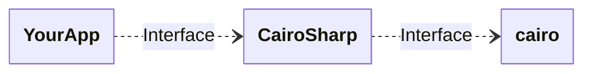

# CairoSharp

CairoSharp is a .NET 8+ wrapper for [_cairo_](https://www.cairographics.org/).

_cairo_ is a 2D graphics library with support for multiple output devices. Currently supported output targets include the X Window System (via both Xlib and XCB), Quartz, Win32, image buffers, PostScript, PDF, and SVG file output.

_cairo_ is designed to produce consistent output on all output media while taking advantage of display hardware acceleration when available (eg. through the X Render Extension).

The _cairo_ API provides operations similar to the drawing operators of PostScript and PDF. Operations in cairo including stroking and filling cubic Bézier splines, transforming and compositing translucent images, and antialiased text rendering. All drawing operations can be transformed by any affine transformation (scale, rotation, shear, etc.)

## Documentation / Tutorials for _cairo_

Some / most of the documentation is for the C language or for Python. But _cairo_ APIs are named everywhere quite similarly, so this shouldn't be a problem.

* [official documentation](https://www.cairographics.org/documentation/)
* [Frequently Asked Questions](https://www.cairographics.org/FAQ/)
* [Cooking with _cairo_](https://www.cairographics.org/cookbook/)
* [ZetCode Cairo graphics tutorial](https://zetcode.com/gfx/cairo/)
* [Mono.Cairo](https://www.mono-project.com/docs/tools+libraries/libraries/Mono.Cairo/) which includes the [Mono.Cairo Tutorial](https://www.mono-project.com/docs/tools+libraries/libraries/Mono.Cairo/tutorial/) and the [Mono.Cairo Cookbook](https://www.mono-project.com/docs/tools+libraries/libraries/Mono.Cairo/cookbook/)
* [_cairo_ API documentation](https://www.cairographics.org/manual/)

Further there are some repositories which showcases the use of _cairo_ or bear some nice tricks:
* [cairo-demo repository](https://gitlab.com/cairo/cairo-demos)
* [Cairou](https://github.com/cubicool/cairou) -- A small library of useful, common Cairo routines.
* [tests directory of the cairo repo](https://gitlab.freedesktop.org/cairo/cairo/-/tree/master/test?ref_type=heads) -- as always, tests showcase how to use an API

## _cairo_ vs Skia

Botht are (vector) graphic libraries, and the drawing model differs a bit. Naturally both have pros and cons, but -- experience in the drawing models aside -- I'd choose based on usage:
* UI rendering: Skia due it's capabilities to use GPU
* everything else: _cairo_, especially as with the same code you can write to different backends like PDF, SVG, PNG, PS

For UI rendering I also use _cairo_, but this is just simple animations in WinForms, and not very hardware demanding. The reason for this is just as I know _cairo_ quite well and can keep the same drawing model for file / stream based backends and for UI.

## License and history

The first official .NET wrapper for _cairo_ lived in the [Mono GTK-Sharp](https://github.com/mono/gtk-sharp/tree/main/cairo) repository, and got licensed under the GNU LGPL. Later on a [zwcloud/CairoSharp](https://github.com/zwcloud/CairoSharp) was created also under the GNU LGPL (I contributes quite a bit to that repository).
Time passed by and the zwcloud-wrapper got outdated and not maintained anymore (no activity since 2020).

_cairo_ got some updates in the meantime, so I started from scratch with a new wrapper for .NET. So this project here isn't a fork of some other wrapper, it's a new project with just some examples / demos taken over. The actual wrapper-code is completely new and based on modern .NET features.

As _cairo_ and all other wrappers are licensed under the GNU LGPL, so does this project too. But this doesn't mean that using this project in your work bring copyleft-virality with it.

The license says
> a larger work using the licensed work through interfaces provided by the licensed work may be distributed under different terms and without source code for the larger work

So graphically it will look like this:

Thus your work is "decoupled" via an interface from the licensed work refered to in the license.

## _cairo_ features implemented

All features, functions, etc. as of _cairo_ version 1.18.5 are implemented. Further there member in the .NET wrapper are documented (xml doc comments), so Intellisense works.

## Supported platforms

This project only supports .NET 8 onwards. For older .NET targets please use https://github.com/zwcloud/CairoSharp, but note that lots of newer _cairo_ APIs are missing there.

| Operating system  | _cairo_ shipped with the package | manual installation                                                           |
|-------------------|----------------------------------|-------------------------------------------------------------------------------|
| Linux             | (see note for stubs below)       | :heavy_check_mark: (see [downloads](https://www.cairographics.org/download/)) |
| Windows x64 / x86 | :heavy_check_mark:                | not needed                                                                    |
| Mac OS            | :x:                              | :heavy_check_mark: (see [downloads](https://www.cairographics.org/download/)) |

* for Windows x64 / x86 the _cairo_ DLL is bundled with the NuGet package, not further installation needed
* for Linux x64, arm64, and arm _stubs_ are bundled with the NuGet package, that aid in the lookup for the shared library due to versioning

I don't have Mac OS, thus there are no stubs available, and I can't tell whether it will work or not.

Minimum _cairo_ version is 1.17.2. For some newer _cairo_ features (the ones added in 1.18 and newer) CairoSharp will throw a `NotSupportedException` if the installed _cairo_ version is too old (1.17.2 was chosen as baseline, as many Windows _cairo_ DLLs are this version -- but CairoSharp comes with it's own _cairo_ DLL for Windows anyway).

## Extensions

There is an accompanying project calls [CairoSharp.Extensions](source/CairoSharp.Extensions/ReadMe.md).

## Why another CairoSharp?

* the others are old, but _cairo_ is still very handy and got recent updates
* others are missing doc comments for Intellisense
* new features like streaming APIs, PDF tags and other meta-data weren't available
* code didn't use features of modern .NET like `Span<T>` and others

So instead of polishing an old wrapper, I chose to start a fresh one. For the name I chose _CairoSharp_, because I'm so used to it, and I dislike names like NCairo, CairoDotNet, and so on.

The NuGet is named `gfoidl.CairoSharp` to have a distincition (and at the moment it's only one for a .NET 8 and newer target).

## Building

### Managed side (the actual wrapper)

Just like any other .NET project / solution. So either via `dotnet build` or via Visual Studio.

When a _cairo_ shared library / DLL is available, that's all and you can start drawing.

### Windows native _cairo_ build

For Windows it's hard to find a downloadable _cairo_ DLL that is recent enough, and especially without any failures. There are quite some around where some features like PDF rendering just don't output anything. Maybe because of wrong set compiler flags -- I didn't investigate these further.

Luckily _cairo_ switched their build system to a modern one. They use [Meson](https://mesonbuild.com/SimpleStart.html), so it's quite easy to build _cairo_ for Windows. See [native build instructions](./native/ReadMe.md).

### Tests

_cairo_ has a lot of [unit tests](https://gitlab.freedesktop.org/cairo/cairo/-/tree/master/test?ref_type=heads) which ideally should be ported also to see if the wrapper works as intended. But for most _cairo_ function the wrapper is really thin, and for methods that require more logic they're touched in the demo / example code to see that they work as they should. Besides that, porting all the tests to this project would be quite an effort...
