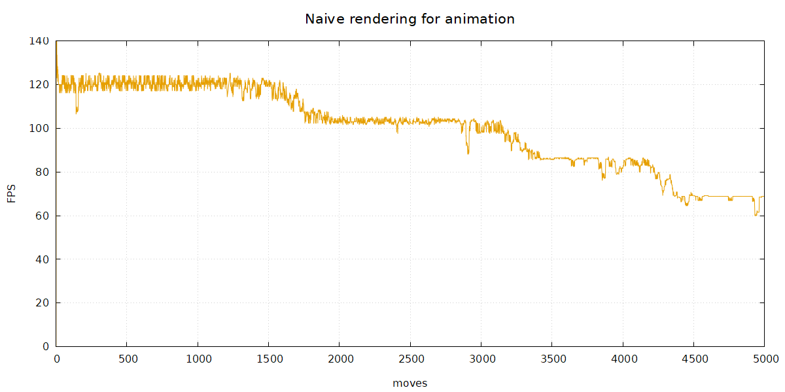
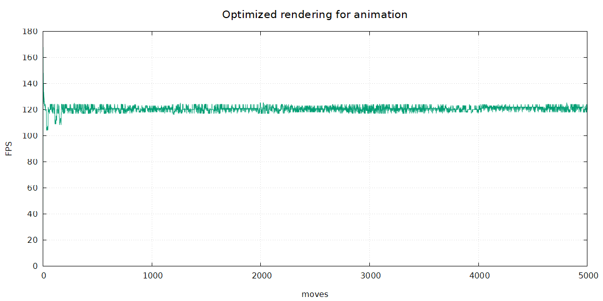

## Gtk4AnimationOptimized

This is similar to [Gtk4AnimationWithBuilder](../Gtk4AnimationWithBuilder/ReadMe.md), but with more optimized drawing.

Gtk4AnimationWithBuilder has a few drawbacks, namely that for simplicity everything is drawn as if it were a static image.

* the trajectory is drawn like [Shlemiel The Painter](https://wiki.c2.com/?ShlemielThePainter) would do it
* the radial gradient of the bullet is created and drawn every time

This results in a drop of [FPS](https://en.wikipedia.org/wiki/Frame_rate), as seen in the following chart:

With the optimization applied the graph looks like:

The optimizations use separate `ImageSurface` for
* once created bullet, which is then used as source for a `Paint`
* appends the trajectory as line which is `Stroke`d, and used as source for `Paint`

Especially the latter speeds-up the drawing, as it's as simple as drawing one line and then a copy to GTK's drawing surface.
