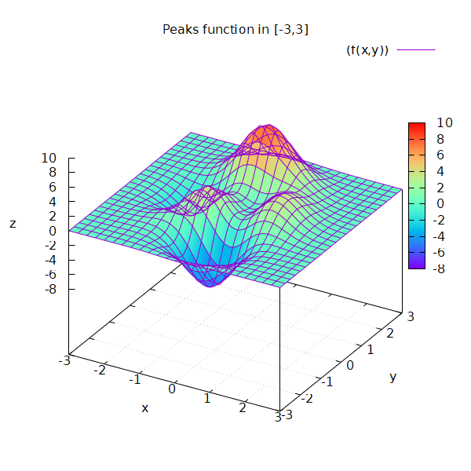
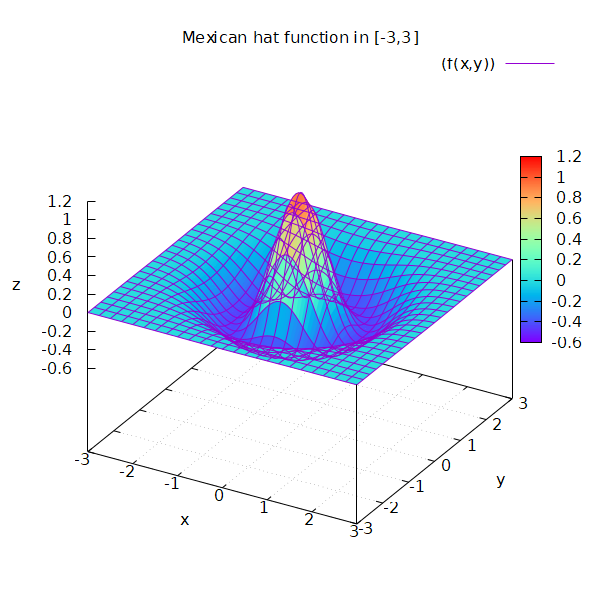

## Gtk4Demo

### Preface

For simplicity all code for a window is in the same file. In real world code it would -- of course -- be split into separate types and files.

In addition to the _cairo_ examples this demo is kind of a playground / learning resource for GTK 4 (for me to have a reference on how some basic stuff is done).

### MainWindow

This shows the [cairo examples](https://www.cairographics.org/samples/) with just a few little additions by me (like hit testing).

### PixelWindow

Shows how to render $z = f(x,y)$ with different color maps.

The following functions are available:

**(modified[^1]) peaks function**

$$
z = f(x, y) = 3 (1 - x)^2 \cdot e^{-x^2} - (y+1)^2 - 10 \left( \frac{x}{5} - x^3 - y^5 \right) \cdot e^{-x^2 - y^2} - \frac{1}{3} \cdot e^{-(x+1)^2 - y^2}
$$

**(original) peaks function**

$$
z = f(x, y) = 3 (1 - x)^2 \cdot e^{-x^2 - (y+1)^2} - 10 \left( \frac{x}{5} - x^3 - y^5 \right) \cdot e^{-x^2 - y^2} - \frac{1}{3} \cdot e^{-(x+1)^2 - y^2}
$$

**mexican hat function**

$$
z = f(x, y) = \frac{1}{\pi \sigma^4} \left( 1 - \frac{x^2 + y^2}{\sigma^2} \right) \cdot e^{-\frac{x^2 + y^2}{2\sigma^2}}
$$

[^1]: maybe I discovered / invented that function by accident, anyway I don't claim anything here :wink:
