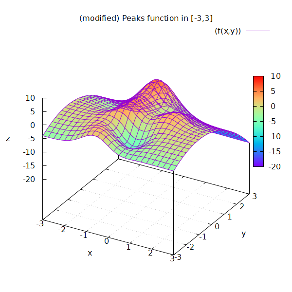
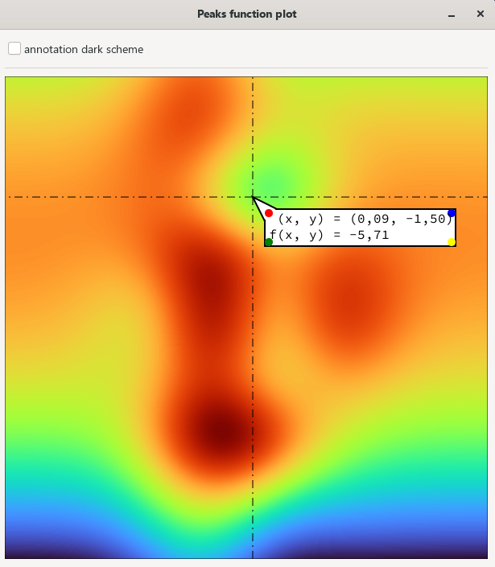
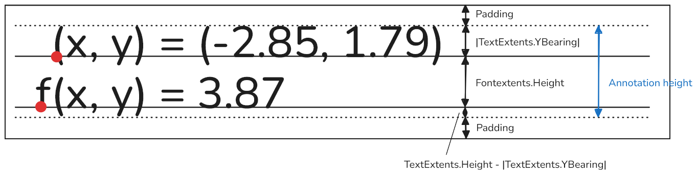

## Gtk4FunctionPlotDemo

### Function

A modified peaks function

$$
z = f(x, y) = 3 (1 - x)^2 \cdot e^{-x^2} - (y+1)^2 - 10 \left( \frac{x}{5} - x^3 - y^5 \right) \cdot e^{-x^2 - y^2} - \frac{1}{3} \cdot e^{-(x+1)^2 - y^2}
$$

is rendered as 2d-plot, and when hovering with the mouse over the plot area the current $(x, y)$ and the function value $z = f(x, y)$ is displayed in a tooltip-like annotation.

### Text layout

> [!NOTE]
> For text that goes beyond charts, etc. a professional text layout engine like [Pango](https://docs.gtk.org/PangoCairo/pango_cairo.html) should be used.

The following figure shows the relevant heights to use for calculating the annotation height, and the height for the bounding box.

For the annotation width and the width of the bounding box it's quite easy: just use the width from the `TextExtents`.
