## Color maps

For a full set of example images of the color maps and it's variants (inverted, grayscale) see [gallery](../../../../images/colors/colormaps/ReadMe.md).

### Default color maps

These are quite basic color maps as used in Matlab and similar visualization tools.

I don't rember when and how the data for these color maps was obtained (CSV files and the bitmap palette for the heat color map).

| Name    | Description                                                                                                                                                                                                                                                    | Example                                                            |
|---------|----------------------------------------------------------------------------------------------------------------------------------------------------------------------------------------------------------------------------------------------------------------|--------------------------------------------------------------------|
| Autumn  | Autumn varies smoothly from red, through orange, to yellow.                                                                                                                                                                                                    | 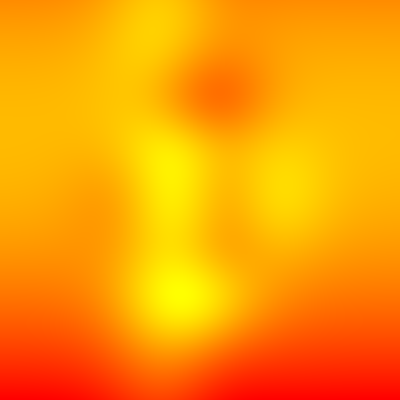  |
| Bone    | Bone is a grayscale colormap with a higher value for the blue component. This colormap is useful for adding an 'electronic' look to grayscale images.                                                                                                          | 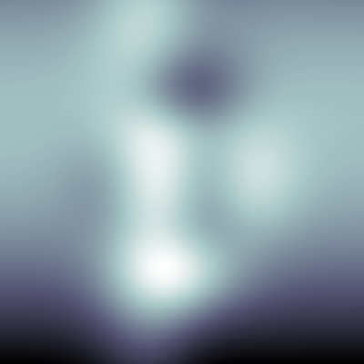    |
| Cool    | Cool consists of colors that are shades of cyan and magenta. It varies smoothly from cyan to magenta.                                                                                                                                                          | 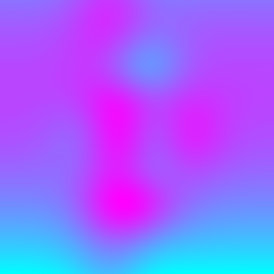    |
| Copper  | Copper varies smoothly from black to bright copper.                                                                                                                                                                                                            | 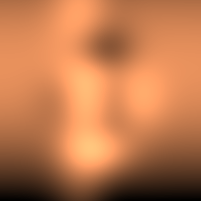  |
| Gray    | Gray represents gray-scales. Can be used invert the grayscales.                                                                                                                                                                                                |     |
| Heat    | Heat varies the color from blue throught skyblue, green, yellow, red to white.                                                                                                                                                                                 | 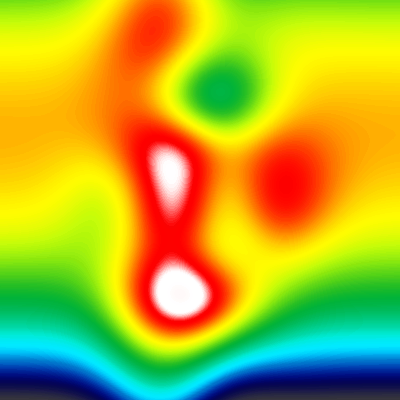    |
| Hot     | Hot varies smoothly from black through shades of red, orange, and yellow, to white.                                                                                                                                                                            | 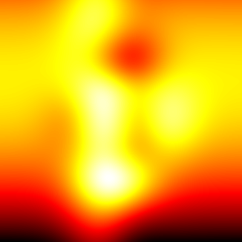     |
| Hsv     | HSV varies the hue component of the hue-saturation-value color model. The colors begin with red, pass through yellow, green, cyan, blue, magenta, and return to red. The colormap is particularly appropriate for displaying periodic functions.               | 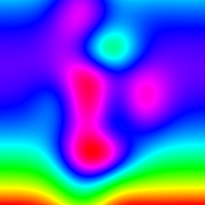     |
| Jet     | Jet ranges from blue to red, and passes through the colors cyan, yellow, and orange. It is a variation of the HSV colormap. The jet colormap is associated with an astrophysical fluid jet simulation from the National Center for Supercomputer Applications. |      |
| Pink    | Pink contains pastel shades of pink. The pink colormap provides sepia tone colorization of grayscale photographs.                                                                                                                                              | 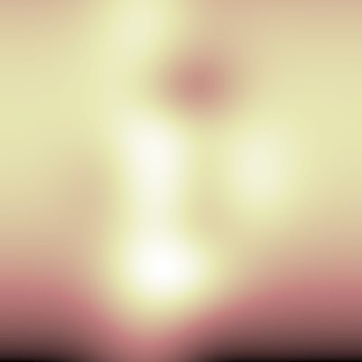    |
| Rainbow | Rainbow consists of color red, green, blue and varies them like a rainbow.                                                                                                                                                                                     | 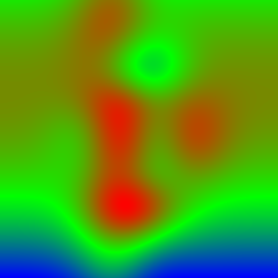 |
| Sine    | Sine varies the color components sine-wavy.                                                                                                                                                                                                                    | 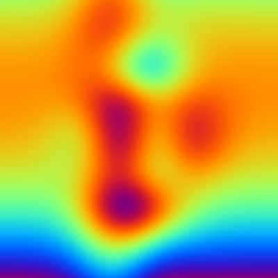    |
| Spring  | Spring consists of colors that are shades of magenta and yellow.                                                                                                                                                                                               | 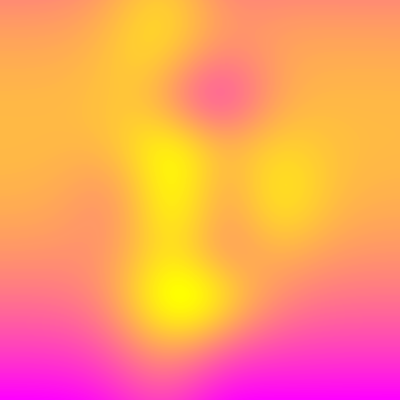  |
| Summer  | Summer consists of colors that are shades of green and yellow.                                                                                                                                                                                                 | 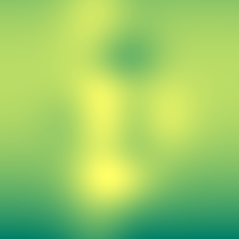  |
| Winter  | Winter consists of colors that are shades of blue and green.                                                                                                                                                                                                   | 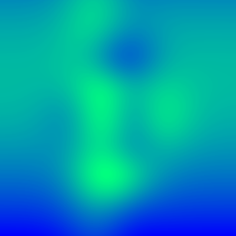  |

### Optimized color maps

These are taken from Kenneth Moreland's [overview page](https://www.kennethmoreland.com/color-advice/),
except turbo color map is taken from [Google Research](https://research.google/blog/turbo-an-improved-rainbow-colormap-for-visualization/).

| Name              | Description                                                                                                                                                                                                                                                                                                                                                                                                                                            | Example                                                                      |
|-------------------|--------------------------------------------------------------------------------------------------------------------------------------------------------------------------------------------------------------------------------------------------------------------------------------------------------------------------------------------------------------------------------------------------------------------------------------------------------|------------------------------------------------------------------------------|
| BentCoolWarm      | BentCoolWarm is a similar color map to SmoothCoolWarm except that the luminance is interpolated linearly with a sharp bend in the middle. This makes for less washed out colors in the middle, but also creates an artifact at the midpoint.                                                                                                                                                                                                           | 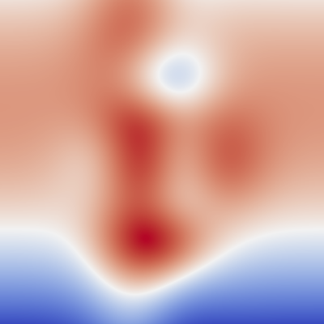      |
| BlackBody         | The black body color map based on the colors of black body radiation. Although the colors are inspired by the wavelengths of light from black body radiation, the actual colors used are designed to be perceptually uniform. Colors of the desired brightness and hue are chosen, and then the colors are adjusted such that the luminance is perceptually linear (according to the CIELAB color space).                                              | 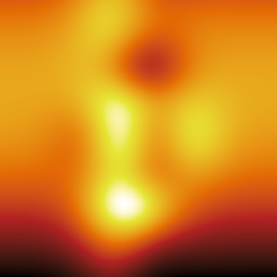         |
| ExtendedKindlmann | The extended Kindlmann color map uses the colors from Kindlmann but also adds more hues by doing a more than 360 degree loop around the hues. This works because the endpoints have low saturation and very different brightness.                                                                                                                                                                                                                      | 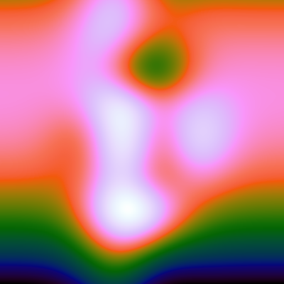 |
| Fast              | Fast is a diverging (double-ended) color map with a smooth transition in the middle to prevent artifacts at the midpoint. This colormap is designed to be used on 3D surfaces, so it avoids getting too dark at the ends (although it does get somewhat dark to extend discriminability).                                                                                                                                                              | 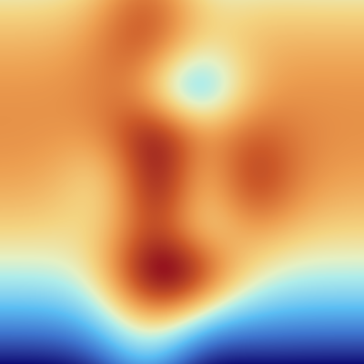              |
| Inferno           | Inferno is a perceptually uniform color map with monotonically increasing luminance. It is similar to black body but also adds some purple hues for a more appealing display.                                                                                                                                                                                                                                                                          | 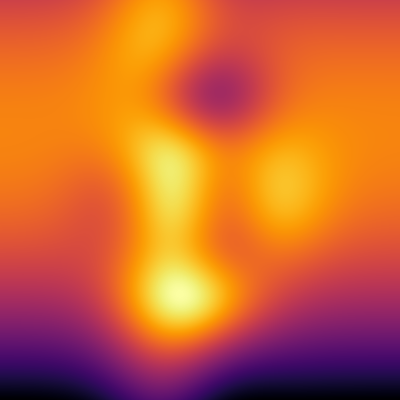           |
| Kindlmann         | Kindlmann is basically the rainbow color map with the luminance adjusted such that it monotonically changes, making it much more perceptually viable.                                                                                                                                                                                                                                                                                                  | 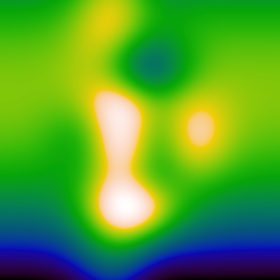         |
| Plasma            | Plasma is a perceptually uniform color map with monotonically increasing luminance and a pleasant smooth arc through blue, purple, and yellow hues. Although none of the colors in plasma reach black, the bottom end of the scale does get dark, so map might need to be shortened for some 3D applications. Inferno is a similar color map that extends the lower range all the way to black for 2D heat maps.                                       | 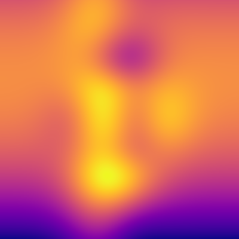            |
| SmoothCoolWarm    | SmoothCoolWarm is a diverging (double-ended) color map with a smooth transition in the middle to prevent artifacts at the midpoint. Although not isoluminant, this color map avoids dark colors to allow shading cues throughout.                                                                                                                                                                                                                      | 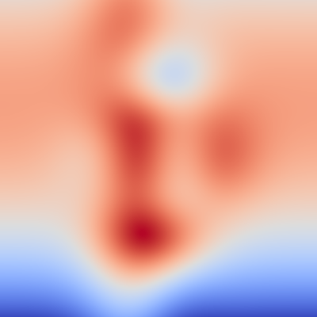    |
| Turbo             | Turbo, a new colormap that has the desirable properties of Jet while also addressing some of its shortcomings, such as false detail, banding and color blindness ambiguity. Turbo was hand-crafted and fine-tuned to be effective for a variety of visualization tasks.                                                                                                                                                                                | 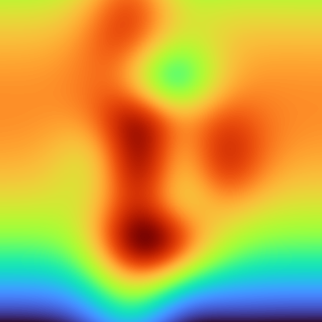             |
| Viridis           | Viridis is a perceptually uniform color map with monotonically increasing luminance and a pleasant smooth arc through blue, green, and yellow hues. Although none of the colors in viridis reach black, the bottom end of the scale does get dark, so map might need to be shortened for some 3D applications. Although viridis is very perceptually smooth and monotonically increasing, it does not have as much discrimination as other color maps. | 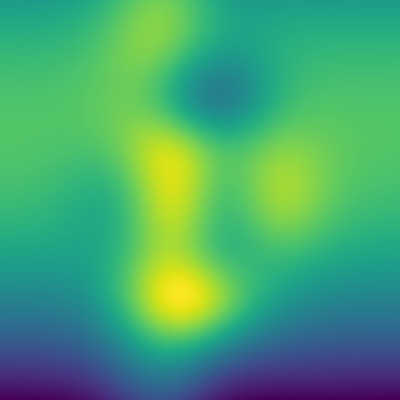           |

### Background information

* [Colour map guideline](https://s-ink.org/colour-map-guideline) -- a flowchart to pick the right type of color map
* [Color gradient (Wikipedia)](https://en.wikipedia.org/wiki/Color_gradient)
* [In Search of a Perfect Colormap](http://inversed.ru/Blog_2.htm)
* [How Bad Is Your Colormap?](https://jakevdp.github.io/blog/2014/10/16/how-bad-is-your-colormap/)
* [Color Map Advice for Scientific Visualization](https://www.kennethmoreland.com/color-advice/)
* [Diverging Color Maps for Scientific Visualization](https://www.kennethmoreland.com/color-maps/)
* [Paper: Diverging Color Maps for Scientific Visualization](https://www.kennethmoreland.com/color-maps/ColorMapsExpanded.pdf)
* [Choosing Colormaps in Matplotlib](https://matplotlib.org/stable/users/explain/colors/colormaps.html)
* [Colormap reference](https://matplotlib.org/stable/gallery/color/colormap_reference.html)
* [mpl colormaps](https://bids.github.io/colormap/)
* [Turbo, An Improved Rainbow Colormap for Visualization](https://research.google/blog/turbo-an-improved-rainbow-colormap-for-visualization/)
* [ColorCET: Perceptually Uniform Colour Maps](https://colorcet.com/)
* [Good Colour Maps: How to Design Them](https://arxiv.org/abs/1509.03700)

And some special notes about the (famous) rainbow color map:

* [The rainbow is dead…long live the rainbow! – series outline](https://mycartablog.com/2012/05/29/the-rainbow-is-dead-long-live-the-rainbow-series-outline/)
* [Default colormaps: Are Parula and Viridis really an improvement over Jet?](https://brushingupscience.com/2019/10/01/default-colormaps-are-parula-and-viridis-really-an-improvement-over-jet/)
* [Rainbow Color Map Critiques: An Overview and Annotated Bibliography (MathWorks, PDF)](https://de.mathworks.com/content/dam/mathworks/tag-team/Objects/r/81137_92238v00_RainbowColorMap_57312.pdf)
* [Rainbow Colormaps – What are they good for? Absolutely nothing!](https://medvis.org/2012/08/21/rainbow-colormaps-what-are-they-good-for-absolutely-nothing/)
* [The end of the rainbow](https://www.climate-lab-book.ac.uk/2014/end-of-the-rainbow/)
* [Why rainbow colour scales can be misleading](https://www.climate-lab-book.ac.uk/2016/why-rainbow-colour-scales-can-be-misleading/)
