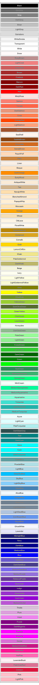

# CairoSharp.Extensions

Provides some common extensions like drawing shapes for [CairoSharp](https://github.com/gfoidl/CairoSharp).

## Shapes

* Shape (abstract)
* Circle
* Square
* Hexagon

## Arrows

* Arrow
* Vector (arrow head on one side only)
* circle arrow head
* open arrow head

## KnownColors

Are based on the color in `System.Drawing`.

